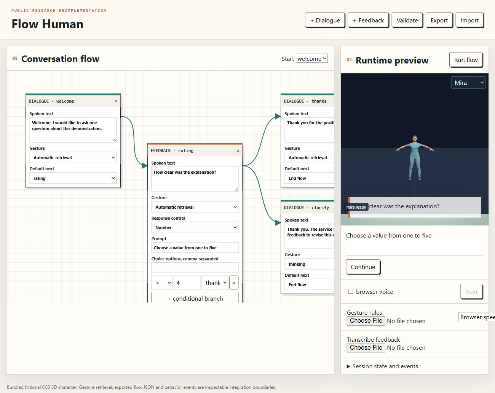

# No-code Digital Human for Conversational Behavior

**Hanseob Kim, Jieun Kim, Ghazanfar Ali, Jae-In Hwang**

**SIGGRAPH Asia Posters · 2022** · Published

[Paper / publisher](https://doi.org/10.1145/3550082.3564175) · [Project page](https://ghazanfarali.com/research/flow-human/) · [BibTeX](CITATION.bib) · [Requirements](REQUIREMENTS.md) · [Code & setup](#implementation-and-usage)

> No-code conversation flows coordinate digital-human behavior.


*Original method figure from the paper: Figure 2, PDF page 2. Extracted for this research introduction; the diagram describes the original system, not verification of this reimplementation.*

## Why this research

Creating a digital-human service normally requires coordinating dialogue, gesture, facial animation and feedback. A flow-based authoring interface makes those behaviors accessible to service designers.

Flow Human lets service designers create a conversation flow using an authoring tool. The system turns that flow into verbal and nonverbal behavior, presents a digital human in a kiosk interaction, and collects user feedback.

## Method at a glance

**Conversation flow** → **Behavior coordination** → **Digital-human interaction**

| | Research system |
|---|---|
| Input | An authored conversation flow |
| Method | Flow-based authoring and coordinated digital-human behavior |
| Output | Speech, facial animation, co-speech gesture, and feedback collection |

## Evidence and scope

System and use-case demonstration in a two-page poster

**Attribution:** These findings describe the paper or manuscript, not results obtained with this repository's code.

**Study context:** Kiosk use case described in the poster.

**Limitations:** Behavior depends on the authored flow and available modules; this poster does not establish unrestricted dialogue competence.

## Explore the implementation

A browser node editor with dialogue lists, weighted and branching feedback, port-based edges, graph validation, feedback export, speech/gesture/viseme events and a 3D character preview.

This repository contains independently written research code. The institute's original source, datasets and trained models are not distributed. Public-data preparation, commands, assumptions and checks are documented below and in [REQUIREMENTS.md](REQUIREMENTS.md).

## Resources and citation

Read the paper through its [publisher record](https://doi.org/10.1145/3550082.3564175). PDFs are hosted by publishers or preprint archives rather than stored in this repository.

Please cite the research paper when using its ideas; [download the BibTeX citation](CITATION.bib). The implementation has its own documented scope.

<!-- demo-preview:start -->
## Demo preview

> [!IMPORTANT]
> **Independent re-implementation, not the original system.** The original code, assets and trained models from this research cannot be shared, so this repository rebuilds the published method from the paper using publicly available data, open-source tools and newly made CC0 avatars. The look, motion, voices and accuracy in this demo reflect that substitute tooling and small demo-scale data; they are not representative of the quality of the original work. To see the original system and its reported results, please refer to the [published paper](https://doi.org/10.1145/3550082.3564175).



*Local demo with small starter examples; the capture illustrates the interface, not a reproduced paper benchmark.*

From the repository root, using the Python environment described below:

```sh
python -m pip install -r scripts/requirements-demo.txt
python scripts/start_demo.py
```

Open **http://127.0.0.1:8080/**. Click **Run flow**, then **Next** or **Continue** to follow the bundled dialogue and feedback branches. Weighted answers accumulate into session variables that later branches test, and **Answers JSON** / **Answers CSV** export the collected feedback. The launcher prepares pinned Three.js modules and, on first run, downloads a small official BEAT BVH/TextGrid sample (four takes, about 80 MB) and the all-MiniLM-L6-v2 Sentence-BERT text model (about 92 MB, Apache-2.0) into ignored `models/`, used for text matching (`--offline` skips the download; `BEAT_SBERT_MODEL` or `SBERT_MODEL` selects another local model). It builds a nine-clip local bank and fits the Automatic Text-to-Gesture rule-map adapter under ignored `outputs/beat-library/`; later runs reuse the cache. The first run needs internet access. Original recordings, large datasets, institute assets, and pretrained gesture weights are not distributed.

The 3D presentation uses shared Three.js avatar components and bundled fictional CC0 characters. The paper-specific algorithms and data adapters live in this repository.

The application uses `automatic` retrieval for recorded co-speech motion: the automatic rule-map lineage described in section 2.2 of the Flow Human paper. The flow editor, branch execution, feedback, and event history remain this application's core. The BEAT preparation and retrieval dependencies are vendored in this repository, so no sibling repository checkout is needed. See `scripts/prepare_beat_demo.py` to rebuild the ignored local bank.

<!-- demo-preview:end -->

## Implementation and usage

<!-- implementation-guide -->

This standalone browser project reimplements the central ideas from **“No-code Digital Human for Conversational Behavior”** by Hanseob Kim, Jieun Kim, Ghazanfar Ali, and Jae-In Hwang, SIGGRAPH Asia 2022 Posters, pp. 1–2. DOI: [10.1145/3550082.3564175](https://doi.org/10.1145/3550082.3564175).

The institute's original implementation is unavailable. This is a new, portable implementation of the paper's flow authoring, conversational behavior coordination, branching feedback, and runtime state. It does not contain the original Unity project, character/voice library, 2,035 gesture clips, learned gesture matcher, kiosk deployment, service data, or study results.

### Interactive quickstart

Prepare the local Three.js viewer and launch the flow editor from this repository root. `prepare_viewer.py` downloads the pinned Three.js 0.170.0 modules from jsDelivr into ignored `static/vendor/`; the editor itself needs only the Python standard library:

```powershell
python scripts/prepare_viewer.py
python scripts/demo.py --port 8020
```

Open http://127.0.0.1:8020. The authored example is ready to run. Edit dialogue and feedback nodes, inspect branches and behavior, then export or import a flow. Without numpy or a prepared BEAT bank, automatic gestures report that recorded motion is unavailable and speech still plays. To enable recorded co-speech motion, run `python -m pip install -r scripts/requirements-demo.txt` and `python scripts/prepare_beat_demo.py` once. The second command downloads one small official BEAT sample.

### Verify the included example

With Node.js 20 or newer:

```bash
npm run verify
npm test
npm run check
```

The verify run executes the same flow validation, weighted feedback, branching and behavior coordination used by the browser. It writes `outputs/verify/flow.json`, `session.json` and `session.csv`, with a completed conversation, accumulated variables and speech/gesture/viseme events. Import the generated flow into the browser to edit it.

The Python side (gesture-rule matching and the demo server) has its own checks:

```bash
python -m pytest tests
python scripts/verify.py            # add --sbert-model PATH to check Sentence-BERT matching
```

`scripts/verify.py` writes `outputs/verify/gesture-match.json`.

To swap in your own content, export a flow from the editor and supply a JSON object mapping feedback node IDs to answers. The runtime and output event format stay the same:

```bash
node scripts/verify.mjs --flow path/to/flow.json --answers path/to/answers.json --output outputs/my-flow
```

The browser demo uses a small local Python server for ES modules and optional speech routes. Export produces portable JSON; import restores it.

### What the runtime does

Each run creates session state with the current node, collected answers, accumulated variables, transcript, and a timestamped event history.

- **Chat nodes** hold a dialogue list. They speak every line in order, or one random variant when the node's mode is random. Each line gets its own gesture retrieval and emits `dialogue`, `gesture` and `viseme` events.
- **Feedback nodes** render choice, 1–5 number, or text controls.
  - **Weighted values (paper section 2.3).** Choice options carry weights (`Product details=2, Opening hours=1`). A number answer contributes its value times the node's optional `weight`. Contributions accumulate into `session.variables[variable]`, which defaults to `score`.
- **Branches.** Ordered branch rules (`=`, `≥`, `≤`, or contains) test either the current answer or an accumulated variable. The default edge is used when none match. `=` compares numerically when both sides are numbers (`4` equals `4.0`), otherwise as case-insensitive text.
- **Edges.** In the editor, drag from a node's output port (the dot beside **Default next** or a branch row) onto another node to connect it. Drop on empty canvas to disconnect. The dropdowns remain available.
- **Saving and export.** The browser saves the flow and the latest session in `localStorage`; **Reset example** clears them. **Answers JSON** and **Answers CSV** download the session for post-analysis: answers, variables, transcript and events. CSV cells that look like spreadsheet formulas are prefixed with `'`.

The browser uses bundled fictional CC0 avatars and locally retrieved BEAT body-motion clips during speech. Playback goes through the shared renderer's speech path with lip sync enabled, and idle behavior stays on. Where the shared renderer provides them, mouths follow text-derived phoneme visemes and the avatar blinks and idles independently of the flow. Older renderer copies fall back to an amplitude mouth envelope. Browser voices and text-derived visemes are not replicas of the paper's text-to-speech service and its 7-mouth-form lip motion from generated audio. Voice choice per digital human is not implemented; the browser or local Kokoro voice is used.

### Flow format

Flows are versioned JSON with `startId` and a `nodes` array.

- **Every node:** `id`, `type`, `text`, an optional `dialogue` list with `dialogueMode` (`sequence` or `random`), `gesture` (`auto` or a named pose), canvas coordinates and an optional default `next`.
- **Feedback nodes add:** `feedbackType`, `prompt`, `options`, `variable`, an optional numeric `weight`, and ordered `branches`.
- **Branch entries:** `{operator, value, target}`. Add `source: "variable"` and `variable` to test an accumulated value.

Flows with only `text` remain valid. Content authors own and review their scripts and collected-feedback policy. No customer responses leave the browser unless the user downloads them.

Manually selected node gestures override retrieval. Automatic gestures use either the locally prepared BEAT clips (vendored rule-map adapter) or an imported rule map; see below. Rowan and Mira are bundled fictional CC0 avatars rather than the institute’s Unity character or animation library.

### Paper component: automatic gesture rules

Flow Human explicitly modifies the [Automatic Text-to-Gesture](https://github.com/ghazanPK/automatic-text-to-gesture) rule-map method (paper section 2.2). Prepare/export that component’s rules in this shape:

```json
{"jointNames": ["Hips", "Neck"], "fps": 30, "floor": 0.45,
 "rules": [{"phrase": "...", "gesture": "...", "frames": [[[0, 1, 0], [0, 1.5, 0]]]}],
 "vectors": {"word": [0.1, 0.2]}}
```

`frames` (`[frame][joint][x,y,z]` positions named by `jointNames`), `fps`, `floor` and `vectors` are optional. Importing a map under **Import rule map** switches **Automatic gestures** to the map.

- **Matching.** A map that supplies its own word `vectors` matches in the browser by summed-vector cosine. Otherwise the server matches each dialogue line.
  - **Sentence-BERT**, as in the paper, needs a locally saved sentence-transformers model: `pip install sentence-transformers`, then `python scripts/demo.py --sbert-model path/to/all-MiniLM-L6-v2` or set `FLOW_SBERT_MODEL`. The rule map also reads `BEAT_SBERT_MODEL`, `SBERT_MODEL` and `models/all-MiniLM-L6-v2`, the settings the recorded BEAT route uses, so both use the same encoder. `python scripts/start_demo.py` downloads all-MiniLM-L6-v2 once (about 92 MB) into the git-ignored `models/all-MiniLM-L6-v2`, so the rule map and the BEAT route use it from the first launch; `--offline` skips the download, and `python scripts/beat_demo/fetch_models.py` fetches it on its own. The server loads the model offline from that folder; `scripts/demo.py` itself never downloads.
  - **TF-IDF** over the rule phrases is used when no model is configured, or when a model named only by an environment variable cannot load. The **Rule map** option names the encoder in use.
- **Similarity floor.** Scores below the floor return `idle`, not the nearest rule; with Sentence-BERT, text without any content word in the model vocabulary also returns `idle`. Defaults: SBERT 0.25 (all-MiniLM-L6-v2 scores on-topic lines 0.28-0.82 and unrelated lines 0.10-0.13 against the example map), TF-IDF 0.2, browser word vectors 0.5, browser lexical fallback 0.15.
- **Playback.** A matched rule with `frames` plays those frames on the avatar at its `fps`. A matched rule without frames plays its named pose.

The BEAT route remains the default. The browser quickstart prepares a small official BEAT sample and fits the vendored automatic adapter locally, and the repository runs standalone. Not reproduced: the paper's 2,035-gesture library.

### Optional speech

Browser speech is the immediate fallback. Install `pip install kokoro soundfile faster-whisper` for local speech; prepare Kokoro phonemizer dependencies from https://github.com/hexgrad/kokoro. Set `KOKORO_MODEL_DIR` to locally downloaded Kokoro-82M `config.json`, `kokoro-v1_0.pth` and `voices/af_heart.pt`, and `WHISPER_MODEL_DIR` to a converted faster-whisper small folder containing `model.bin`. Restart the server, choose Local Kokoro, or upload audio for feedback transcription. Models are downloaded by the user and stay outside Git. Speech and the phoneme approximation are disclosed engineering substitutions.

<!-- avatar-recorded-motion:start -->
## Bundled characters and recorded public motion

The browser demos include Rowan and Mira, two new fictional GLB characters built with MPFB and MakeHuman community assets under CC0 1.0. See [avatar licensing and provenance](static/avatars/LICENSE.md). Use the character selector in the stage. The shared renderer supports body bones, ARKit facial channels, and approximate speaking motion.

Recorded motion is adapted to the characters' proportions. Palm landmarks set hand orientation; finger curl uses bounded hinge bends and preserves the character's finger spacing. Thumb-base opposition stays in the authored pose, with conservative recorded curl at the remaining joints. Distal bends are estimated from the preceding joint when fingertip landmarks are absent. Use the companion's hand close-up views to inspect the result.

The [avatar motion companion](static/recorded-motion.html) opens at `/static/recorded-motion.html` while the demo server is running. A small authored motion and face sample loads automatically; click **Play** without uploading files. It also plays locally selected BEAT motion, face, and WAV files on the bundled characters. These are presentation and data-inspection tools, separate from the paper implementation. No BEAT recording, dataset archive, or trained model is bundled. For recorded public motion, install the one preparation dependency and fetch a small official sample into ignored `outputs/beat-demo/`:

```sh
python -m pip install numpy
python scripts/beat_demo/fetch_modalities.py --speaker 1 --sequence 1_wayne_0_1_1 --include-bvh --max-bytes 25000000 --output-dir outputs/beat-demo/source
python scripts/beat_demo/prepare_bvh.py --bvh outputs/beat-demo/source/1_wayne_0_1_1.bvh --output outputs/beat-demo/sample/1_wayne_0_1_1-raw-motion.json --frames 120
python scripts/beat_demo/prepare_modalities.py --sequence 1_wayne_0_1_1 --source outputs/beat-demo/source --output outputs/beat-demo/sample --frames 120
```

Open the companion and select `outputs/beat-demo/sample/1_wayne_0_1_1-raw-motion.json`, `1_wayne_0_1_1-face.json`, and `1_wayne_0_1_1.wav`. The downloader caps each original file at 25 MB; the prepared clip contains up to 120 frames. The viewer uses local files and does not upload them. For other BEAT takes, substitute a matching official speaker and sequence ID.

If you already have OmniMo's processed 52-joint Unity humanoid data, use that normalized motion instead:

```sh
python scripts/beat_demo/prepare.py --dataset /path/to/processed/beat --speaker 1 --take 1_wayne_0_1_1 --output outputs/beat-demo/sample/1_wayne_0_1_1-motion.json --max-frames 120
```

Select the resulting `*-motion.json` in the companion. Its metadata carries the humanoid joint mapping and source-to-avatar coordinate conversion. The viewer fits source FK directions from the avatar's bind pose, following the spine explicitly at branching joints. This avoids applying incompatible source bone twist to the MPFB skin; it does not reproduce exact performer twist. The adapter supports Unity proximal/intermediate/distal finger names. Raw BVH remains a public-data alternative; do not mix the two skeleton conventions.
<!-- avatar-recorded-motion:end -->

## License

Code is MIT licensed; see [LICENSE](LICENSE). The bundled fictional characters and authored starter fixtures keep their CC0 1.0 dedication, and datasets or models you download keep their own licences.
