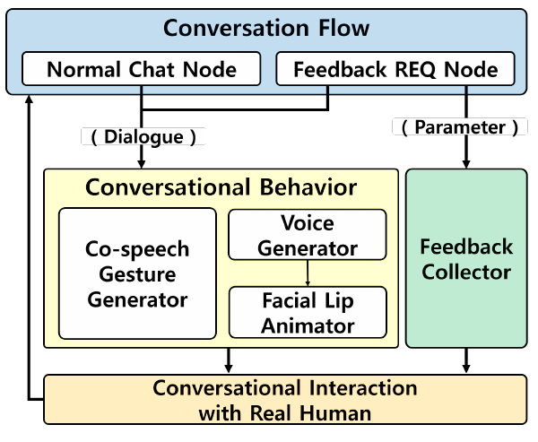

# No-code Digital Human for Conversational Behavior

**Hanseob Kim, Jieun Kim, Ghazanfar Ali, Jae-In Hwang**

**SIGGRAPH Asia Posters · 2022** · Published

[Paper / publisher](https://doi.org/10.1145/3550082.3564175) · [Project page](https://ghazanfarali.com/research/flow-human/) · [BibTeX](CITATION.bib) · [Requirements](REQUIREMENTS.md) · [Code & setup](#implementation-and-usage)

> No-code conversation flows coordinate digital-human behavior.



*Original method figure from the paper: Figure 2, PDF page 2. Extracted for this research introduction; the diagram describes the original system, not verification of this reimplementation.*

## Why this research

Creating a digital-human service normally requires coordinating dialogue, gesture, facial animation and feedback. A flow-based authoring interface makes those behaviors accessible to service designers.

Flow Human lets service designers create a conversation flow using an authoring tool. The system turns that flow into verbal and nonverbal behavior, presents a digital human in a kiosk interaction, and collects user feedback.

## Method at a glance

**Conversation flow** → **Behavior coordination** → **Digital-human interaction**

| | Research system |
|---|---|
| Input | An authored conversation flow |
| Method | Flow-based authoring and coordinated digital-human behavior |
| Output | Speech, facial animation, co-speech gesture, and feedback collection |

## Evidence and scope

System and use-case demonstration in a two-page poster

**Attribution:** These findings describe the paper or manuscript, not results obtained with this repository's code.

**Study context:** Kiosk use case described in the poster.

**Limitations:** Behavior depends on the authored flow and available modules; this poster does not establish unrestricted dialogue competence.

## Explore the implementation

A browser node editor with branching feedback, graph validation, session state, speech/gesture/viseme events and a schematic character preview.

This repository contains independently written research code. The institute's original source, datasets and trained models are not distributed. Public-data preparation, commands, assumptions and checks are documented below and in [REQUIREMENTS.md](REQUIREMENTS.md).

## Resources and citation

Read the paper through its [publisher record](https://doi.org/10.1145/3550082.3564175). PDFs are hosted by publishers or preprint archives rather than stored in this repository.

Please cite the research paper when using its ideas; [download the BibTeX citation](CITATION.bib). The implementation has its own documented scope.

## Implementation and usage

<!-- implementation-guide -->

This standalone browser project reimplements the central ideas from **“No-code Digital Human for Conversational Behavior”** by Hanseob Kim, Jieun Kim, Ghazanfar Ali, and Jae-In Hwang, SIGGRAPH Asia 2022 Posters, pp. 1–2. DOI: [10.1145/3550082.3564175](https://doi.org/10.1145/3550082.3564175).

The institute's original implementation is unavailable. This is a new, portable implementation of the paper's flow authoring, conversational behavior coordination, branching feedback, and runtime state. It does not contain the original Unity project, character/voice library, 2,035 gesture clips, learned gesture matcher, kiosk deployment, service data, or study results.

### Interactive quickstart

Prepare the local Three.js viewer and launch the flow editor from this repository root. No npm dependencies or model downloads are required:

```powershell
python scripts/prepare_viewer.py
python scripts/demo.py --port 8020
```

Open http://127.0.0.1:8020. The authored example is ready to run. Edit dialogue and feedback nodes, inspect branches and behavior, then export or import a flow.

### Verify the included example

With Node.js 20 or newer:

```bash
npm run verify
npm test
npm run check
```

The verify run executes the same flow validation, branching and behavior coordination used by the browser. It writes `outputs/verify/flow.json` and `session.json`, with a completed conversation and speech/gesture/viseme events. Import the generated flow into the browser to edit it.

To swap in your own content, export a flow from the editor and supply a JSON object mapping feedback node IDs to answers. The runtime and output event format stay the same:

```bash
node scripts/verify.mjs --flow path/to/flow.json --answers path/to/answers.json --output outputs/my-flow
```

The browser demo uses a small local Python server for ES modules and optional speech routes. Export produces portable JSON; import restores it.

### What the runtime does

Each run creates session state with the current node, collected answers, variables, transcript, and a timestamped event history. Dialogue nodes emit `dialogue`, `gesture`, and deterministic text-timed `viseme` events. Feedback nodes render choice, 1–5 number, or text controls. Ordered branch rules (`=`, `≥`, `≤`, or contains) choose the next node; the default edge is used when none match.

The built-in figure is deliberately schematic. It previews idle blinking, mouth cues, gesture names, and optional browser speech synthesis. A production renderer can consume the same event log to drive a licensed avatar, phoneme-aligned lip synchronization, and a gesture system. Browser voices and the simple viseme heuristic are not replicas of the paper's Naver TTS and animation pipeline.

### Flow format

Flows are versioned JSON with `startId` and a `nodes` array. A node contains `id`, `type`, `text`, `gesture`, canvas coordinates, an optional default `next`, and, for feedback, `feedbackType`, `prompt`, `options`, and ordered `branches`. Content authors own and review their scripts and collected-feedback policy. No customer responses leave the browser in this implementation.

Automatic gesture selection uses an explicit lexical example map by default. Import a real rule map to use summed GloVe vectors and retrieved motion clips, rather than treating manually selected gesture names as a trained model. Original procedural Three.js geometry replaces the institute’s Unity avatar; no avatar or animation assets are bundled.

### Paper component: automatic gesture rules

Flow Human explicitly modifies the [Automatic Text-to-Gesture](https://github.com/ghazanPK/automatic-text-to-gesture) rule-map method (paper section 2.2). Prepare/export that component’s rules as `{ "rules": [{ "phrase": "...", "gesture": "...", "frames": [[[0,1,0]]], "fps": 30, "edges": [] }], "vectors": { "word": [0.1,0.2] } }`. `frames`, `fps`, `edges` and `vectors` are optional. With supplied vectors the browser performs summed-word-vector cosine retrieval; without them it labels the lexical baseline. This is a file-based integration, so the repo remains standalone.

### Optional speech

Browser speech is the immediate fallback. Install `pip install kokoro soundfile faster-whisper` for local speech; prepare Kokoro phonemizer dependencies from https://github.com/hexgrad/kokoro. Set `KOKORO_MODEL_DIR` to locally downloaded Kokoro-82M `config.json`, `kokoro-v1_0.pth` and `voices/af_heart.pt`, and `WHISPER_MODEL_DIR` to a converted faster-whisper small folder containing `model.bin`. Restart the server, choose Local Kokoro, or upload audio for feedback transcription. Models are downloaded by the user and stay outside Git. Speech and the phoneme approximation are disclosed engineering substitutions.

<!-- avatar-recorded-motion:start -->
## Bundled characters and recorded public motion

The browser demos include Rowan and Mira, two new fictional GLB characters built with MPFB and MakeHuman community assets under CC0 1.0. See [avatar licensing and provenance](static/avatars/LICENSE.md). Use the character selector in the stage. The shared renderer supports body bones, ARKit facial channels, and approximate speaking motion.

Recorded motion is adapted to the characters' proportions. Palm landmarks set hand orientation; finger curl uses bounded hinge bends and preserves the character's finger spacing. Distal bends are estimated from the preceding joint when fingertip landmarks are absent. Use the companion's hand close-up views to inspect the result.

The [recorded BEAT motion companion](static/recorded-motion.html) opens at `/static/recorded-motion.html` while the demo server is running. It plays locally selected motion, face, and WAV files on the bundled characters; this is recorded public-data inspection, separate from the paper implementation. No BEAT recording, dataset archive, or trained model is bundled. Install the one preparation dependency and fetch a small official sample into ignored `outputs/beat-demo/`:

```sh
python -m pip install numpy
python scripts/beat_demo/fetch_modalities.py --speaker 1 --sequence 1_wayne_0_1_1 --include-bvh --max-bytes 25000000 --output-dir outputs/beat-demo/source
python scripts/beat_demo/prepare_bvh.py --bvh outputs/beat-demo/source/1_wayne_0_1_1.bvh --output outputs/beat-demo/sample/1_wayne_0_1_1-raw-motion.json --frames 120
python scripts/beat_demo/prepare_modalities.py --sequence 1_wayne_0_1_1 --source outputs/beat-demo/source --output outputs/beat-demo/sample --frames 120
```

Open the companion and select `outputs/beat-demo/sample/1_wayne_0_1_1-raw-motion.json`, `1_wayne_0_1_1-face.json`, and `1_wayne_0_1_1.wav`. The downloader caps each original file at 25 MB; the prepared clip contains up to 120 frames. The viewer uses local files and does not upload them. For other BEAT takes, substitute a matching official speaker and sequence ID.

If you already have OmniMo's processed 52-joint Unity humanoid data, use that normalized motion instead:

```sh
python scripts/beat_demo/prepare.py --dataset /path/to/processed/beat --speaker 1 --take 1_wayne_0_1_1 --output outputs/beat-demo/sample/1_wayne_0_1_1-motion.json --max-frames 120
```

Select the resulting `*-motion.json` in the companion. Its metadata carries the humanoid joint mapping and source-to-avatar coordinate conversion. The viewer fits source FK directions from the avatar's bind pose, following the spine explicitly at branching joints. This avoids applying incompatible source bone twist to the MPFB skin; it does not reproduce exact performer twist. The adapter supports Unity proximal/intermediate/distal finger names. Raw BVH remains a public-data alternative; do not mix the two skeleton conventions.
<!-- avatar-recorded-motion:end -->
